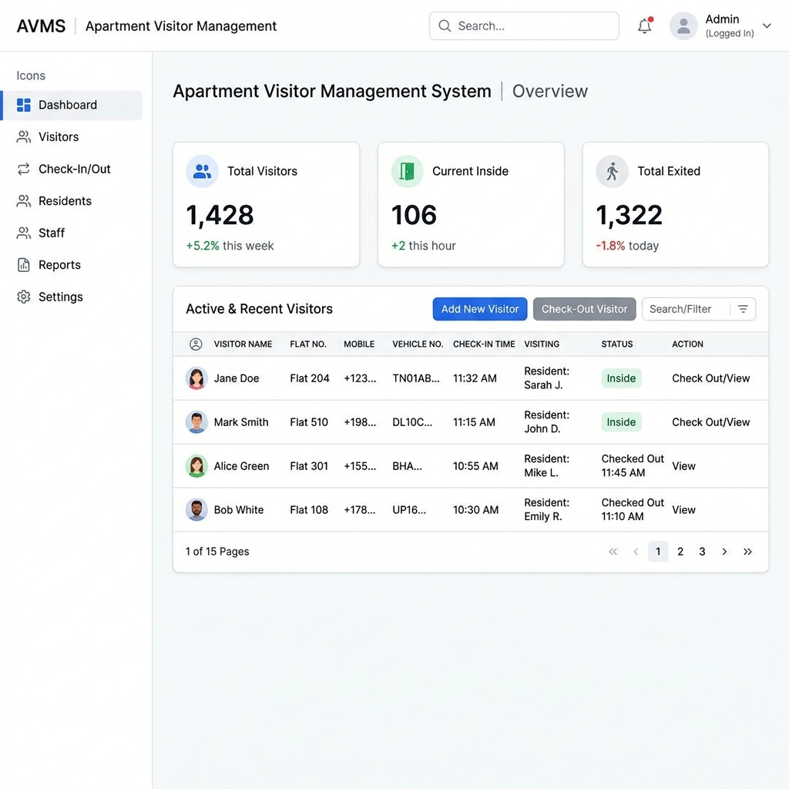

# 🏢 Apartment Visitor Management System

A robust, full-stack web application built with Python (Flask) and SQLite for securely managing apartment visitor entries, tracking their status (Inside/Exited), and generating insightful statistics.

## 📸 Dashboard Overview

*(Note: Replace `dashboard.png` with an actual screenshot of your running dashboard)*



## ✨ Features

- **Admin Dashboard**: Real-time statistics including total visitors, today's arrivals, and current personnel indoors.
- **Visitor Logs (CRUD)**: Seamlessly log new visitors with required details and track check-in/check-out times.
- **Search & Filter**: Quickly lookup visitor records by Name, Phone, or Flat Number, and seamlessly filter by their current status.
- **Data Export**: Easily export all historical visitor records to a `.csv` file.
- **Secure Login**: Protected routes using session-based authentication to ensure only authorized admins can access the system.

## 🛠️ Technology Stack

- **Backend**: Python, Flask
- **Database**: SQLite
- **Frontend**: HTML5, Vanilla CSS, JavaScript
- **Icons/Fonts**: (As configured in `templates/` and `static/` files)

## 🚀 Getting Started

### 1. Prerequisites
Make sure you have Python 3.x installed on your operating system.

### 2. Installation
Navigate to your project directory and make sure necessary libraries are installed (Flask is required).

```bash
# If using a virtual environment (optional)
python3 -m venv venv
source venv/bin/activate

# Install Flask 
pip install Flask
```

### 3. Running the Application

Start the Flask server using the primary app entry point:

```bash
python app.py
```

- **Local URL**: `http://127.0.0.1:5000`
- **Default Admin Credentials**:
  - **Username**: `admin`
  - **Password**: `admin123`

## 📂 Project Structure

```
.
├── app.py                # Main Flask application and routes
├── visitors.db           # SQLite database (auto-generated)
├── static/               
│   ├── style.css         # Application styling
│   └── script.js         # Client-side validation and interactivity
└── templates/            
    ├── login.html        # Authentication page
    ├── dashboard.html    # Statistics & overview dashboard
    └── index.html        # Main visitor tracking & logs page
```

## 📝 License & Future Improvements
This is currently a locally-operated application built for standard apartment or gated-community management. In future versions, password hashing (e.g. bcrypt) should be implemented for more secure production deployment.
